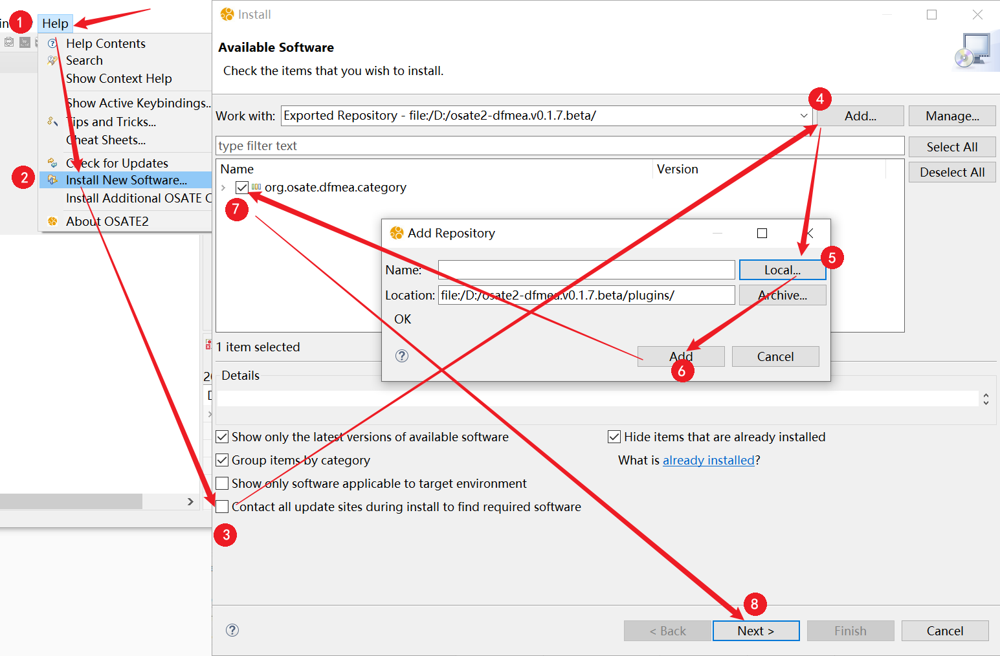
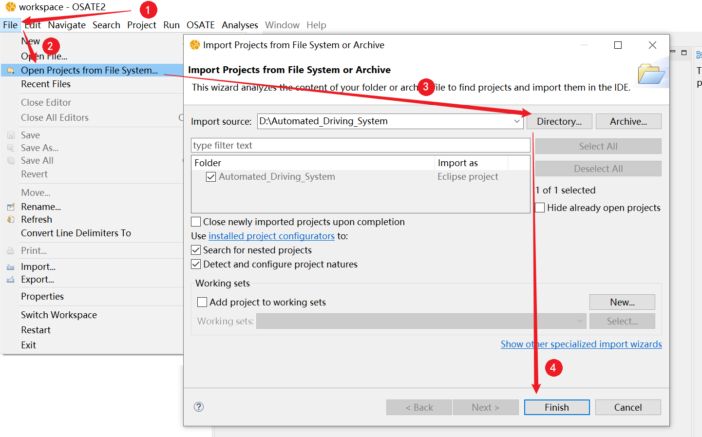
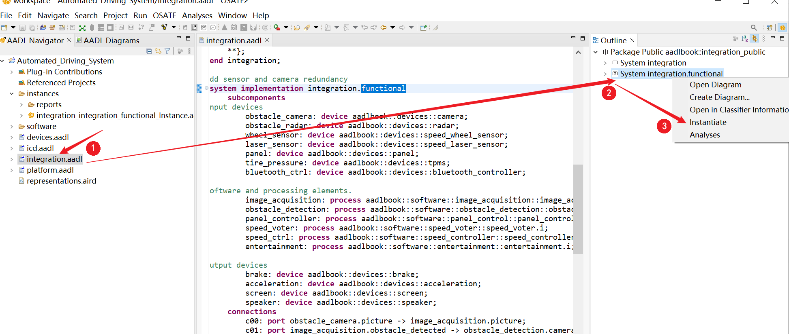

# OSATE2 DFMEA User Documentation

An eclipse plug-in for `OSATE2`,  can be used perform `DFMEA` analysis on AADL models. 

## Plug-in installation

1. First, you need to download [OSATE2](https://osate.org/download-and-install.html)

2. Obtain the latest plugin compression package `osate2-dfmea.v0.1.7.zip` from [latest release](https://github.com/767251930/osate2-dfmea/releases). page and unzip it

3. Open Osate2 (***version >= 2.11.0***) tool, From the top menu bar, click on:

   `1:Help`-> `2:Install New Software` -> `3:Uncheck the "Contact all update sites"`-> 

   `4:Add` -> `5:Local` -> `Browse and select the folder extracted from the step1`-> `6:Add` -> `7:Check the plugin`-> `8:Next` ->

   `Next`->`I accept the terms of the license agreement`-> `Finish `

4. If the installation process encountered a pop-up window，choose `Trust all unsigned content`，Restart the OSATE2 tool to complete the installation

 

## Case study : Automated Driving System

This example comes from [*AADL In Practice*](http://julien.gunnm.org/aadl-book)

### Import Example

1. Obtain the Example project `Automated_Driving_System.zip` from [latest release](https://github.com/767251930/osate2-dfmea/releases). page and unzip it

2. Open Osate2 tool, From the top menu bar, click on:

   `1:File`-> `2:Open Projects from File System` -> `3:Directory`-> `Select the Unzipped Project Folder` -> `4:Finish`

 

### Use of DFMEA Plug-in

1. Instantiate the top level system `integration.functional` from `integration.aadl` file outline

   `1:Double click integration.aadl`-> `2:Right click System integration.functional from Outline` -> `3:Instantiate`

   The instances file `integration_integration_functional_Instance.aaxl2` will be generated in `instances` folder of project




2. Select the target instantiation file(.aaxl2)
3. From the top menu bar, click on: `Analyses` -> `DFMEA` -> `Run Failure Mode Effect and Analysis`
4. Select the focus component to analyze（The plugin will first automatically select the component recorded with attribute `AIAG_VDA::Head` in the top-level component as the focus component）
5. Check the analysis related options

- `Only show failure modes...` : After checking, only the `error state` and `out error out propagation` in the failure propagation, as well as other failure element with FMEA attributes, will be output in the failure analysis.
- `Only show final failure...` : After checking, only the final failure effect and initial failure cause in the failure propagation will be output in the failure analysis.
- `Show component name...` : Check the box to display the component names of the related elements in the functional analysis and failure analysis cells.
- `Show the whole failure net...` : After checking, a graphical window will be created to display the complete fault net of the system.

6. Click `OK` to perform analysis, the plug -in will pop up "FMEA Report Generation Complete" to represent the analysis process.
7. The analysis report will be generated in the `./instances/reports/fmea` directory of the project.


### Result of DFMEA

This is a complete fault net of the Automated Driving System system through the analysis of the DFMEA plug-in.


This is the DFMEA Seven Step excel report of the Automated Driving System system through the analysis of the DFMEA plug-in.

The light yellow cells in the failure analysis column represent the `failure modes` that are considered the `final failure effect` and the `initial failure cause`


### Introduce of Example

We use a simple case of Automated Driving System to illustrate how to use this plug-in to conduct DFMEA analysis in AADL.

Our goal is to focus on some security critical features and demonstrate how this plugin can help analyze them and design real-time, security critical systems.


The Automated Driving System captures images of the car as it moves to detect obstacles on the road. It uses two speed sensors to detect actual speed and to activate acceleration or braking functions. 

If an obstacle is detected, the car will brake (the force will vary depending on the distance between the car and the obstacle) . 

If there is no obstacle, the acceleration function can be activated. The car also includes entertainment features, such as music, and a screen that provides feedback to passengers, such as actual speed and desired speed. 

Passengers can also use a panel to set the desired speed. The new cars are said to connect to and interact with passengers' devices, such as mobile phones or tablets. Obstacle detection and speed adjustment are key functions that must be operated in a real-time and deterministic manner. The system must satisfy security:

- failure of the entertainment system can not result in failure of the braking and acceleration functions. 

- the speed sensor is redundant and the failure of only one speed sensor can not stop the car from running.

We used a common system implementation (called a functional model) to define the AADL model, which was later refined into two variants that included deployment issues. The generic model contains all the common elements of both architectures. This general-purpose model is not deployment-related: it defines the devices and software components (such as processes) that implement the system, but not the execution platform (such as processor, memory, or bus) . All elements of the schema are concatenated and the data types defined by the AADL data components are exchanged. The functional model defines the different software and hardware components used to implement the system. The system in this case study follows a common `sensing/processing/execution` pattern:

3. Some sensors produce data (for example, speed, obstacle detection) . 
3. This data is processed by some software component and then sent to the actuator. 
3. The actuator is activated based on the data of the processing function (for example, acceleration or braking) .


 

The following AADL components constitute the sensing function:

- `obstacle_camera`：Camera for self driving (captured using AADL device components). It sends the original image to a software component (`image_acquisition`) that detects whether there is an obstacle on the road. This is a critical component.
- `obstacle_radar`：A radar (specified by the AADL device component) that detects obstacles in the road. It sends data directly to the `obstacle` component, which uses processed data from the camera to detect if there is an obstacle on the road. This is a critical component.
- `wheel_sensor`：Sensors located on the wheels to indicate vehicle speed (captured using AADL device components). This is a critical component.
- `laser_sensor`：The other uses laser technology to provide speed sensors (captured using AADL device components) . The sensor is redundant with `wheel` : this value can be used if the wheel sensor fails.
- `bluetooth_ctrl`：A device that receives data from a Bluetooth bus. It docks with entertainment systems, controls the music of cars, and gets contacts and data from mobile phones.
- `tire_pressure`：A device that transmits tire pressure to the `panel` component. This provides the ability to detect low tire pressure and to send a low tire pressure or flat tire warning to the driver.
- `panel`：A device on the steering wheel used to increase or decrease the speed of a car. It sends a signal to the `panel` , which eventually transmits the command to the parts that control the speed of the car. This is not a critical component: if something goes wrong (for example, the system starts up the accelerator inappropriately) , the software can detect it and prevent potentially dangerous behavior.

The following components make up the processing part of the system and depend on the software components:

- `image_acquisition`：Use the original data of the camera to determine whether there are obstacles.
- `obstacle_detection`：Use data from `image_acquisition` and `obstacle_radar` to determine if there are actual obstacles on the road. This component acts like a redundant/voting system for image acquisition.
- `speed_voter`：Receive speed from both `wheel_sensor` and `laser_sensor`, eliminate potential bad values (due to transmission error, a sensor failure, etc.) , and output a consistent speed value, this value will be used by the speed controller and displayed on the screen.
- `speed_ctrl`：Use the expected speed from passengers, actual speed, and information from `obstacle_detection`, appropriately activate acceleration or braking.
- `entertainment`：Receive data (contacts and music) from `bluetooth_ctrl`, send music to the speakers, and display information on the dashboard screen.
- `panel_controller`：Get information from the `panel` (whether acceleration or braking functions are activated) , actual speed and tire pressure. The component then generates the required speed and information to be displayed on the dashboard screen.

Finally, the following components represent the execution part of the system:

- `brake`：A device for applying brakes to car wheels.
- `acceleration`：A device that adjusts the engine and increases speed.
- `speaker`：The output of a car audio system, where the sound is produced.
- `screen`：The screen on the dashboard.

Here is a graphical representation of the AADL model:


## Introduce of DFMEA Plug-in

The Plug-in Follow the [AIAG-VDA DFMEA](https://www.aiag.org/quality/automotive-core-tools/fmea) standard.

The AIAG-VDA DFMEA adds consideration of system structure, function, and risk analysis to the analysis steps, leading to a more robust FMEA development process.
The DFMEA analysis process consists of seven steps.

 

#### Property Set

To provide a comprehensive DFMEA analysis, we have defined a property set named `AIAG_VDA`, which offers additional information appended to the AADL components and the error elements.

- `AIAG_VDA::Head`：
  - Assign top-level components to record FMEA header information and focus components for this analysis to support the planning and preparation steps of the FMEA process.

- `AIAG_VDA::DFMEA`：
  - Assign failure elements to relevant components of the system, add `failure descriptions` and their `violated functions` to support DFMEA function analysis step and failure analysis step.
  - Assign failure elements to relevant components of the system, add `current detection/prevention measures` for the failure, and their measurement indicators `(S/O/D)` to support the DFMEA risk analysis step.

- `AIAG_VDA::Optimization`：
  - Assign failure elements to relevant components of the system, add `optimized detection/prevention measures` for the fault, optimized measurement indicators `(O/D)`, and other `additional information` to support the DFMEA optimization analysis step.

**AADL models that have completed architectural modeling and error modeling can perform structural analysis of DFMEA and core failure analysis step without recording additional information through the `AIAG_VDA` property set**.

```c
	property set AIAG_VDA is

	Head: record (
		CompanyName: aadlstring; 			-- company name 		
		EngineeringLocation: aadlstring; 	-- engineering location 	
		CustomerName: aadlstring; 			-- customer name 			
		ModelYearProgram: aadlstring; 		-- model years/programs 	
		Subject: aadlstring; 				-- subject				 	
		DFMEAStartData: aadlstring; 		-- DFMEA start date 		
		DFMEARevisionData: aadlstring; 		-- DFMEA revision date 	
		CrossFuncTeam: aadlstring; 			-- cross-functional team 
		DFMEAID: aadlstring; 				-- DFMEA ID number 		
		DesignResponsibility: aadlstring; 	-- design responsibility	
		ConfidentialityLevel: aadlstring; 	-- confidentiality level 	
		FocusComponent: aadlstring; 		-- focus component		
	)applies to (all);


	DFMEA: record (
		FailureDescription: aadlstring;		-- description of the failure mode
		Function:aadlstring;				-- description of the function violated by the failure mode
		Severity: aadlinteger 1 .. 10;		-- severity of failure effect  
		PC: aadlstring;						-- current prevention control of failure cause 
		Occurrence: aadlinteger 1 .. 10;	-- occurrence of failure cause 
		DC: aadlstring;						-- current detection control of failure cause/failure mode
		Detection: aadlinteger 1 .. 10;		-- detection of failure cause/failure mode)
	)applies to ({emv2}**error type, {emv2}**type set, {emv2}**error behavior state,
		{emv2}**error propagation, {emv2}**error event, {emv2}**error flow);

	Optimization: list of record (
		OptPC: aadlstring;					-- DFMEA optimized preventive action 
		OptDC: aadlstring;					-- DFMEA optimized detection action 
		ResponsPerson: aadlstring;			-- responsible person's name
		TargetCompletionData: aadlstring;	-- target completion date
		Status: aadlstring;					-- status
		Evidence: aadlstring;				-- action taken with pointer to evidence
		CompletionData: aadlstring;			-- completion date
		OptOccurrence: aadlinteger 1 .. 10;	-- optimized occurrence
		OptDetection: aadlinteger 1 .. 10;	-- optimized detection
		Notes: aadlstring;					-- notes
	)applies to ({emv2}**error type, {emv2}**type set, {emv2}**error behavior state,
		{emv2}**error propagation, {emv2}**error event, {emv2}**error flow);
		
end AIAG_VDA;
```


